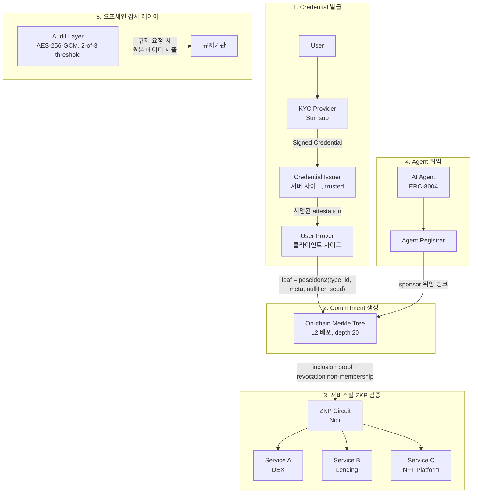
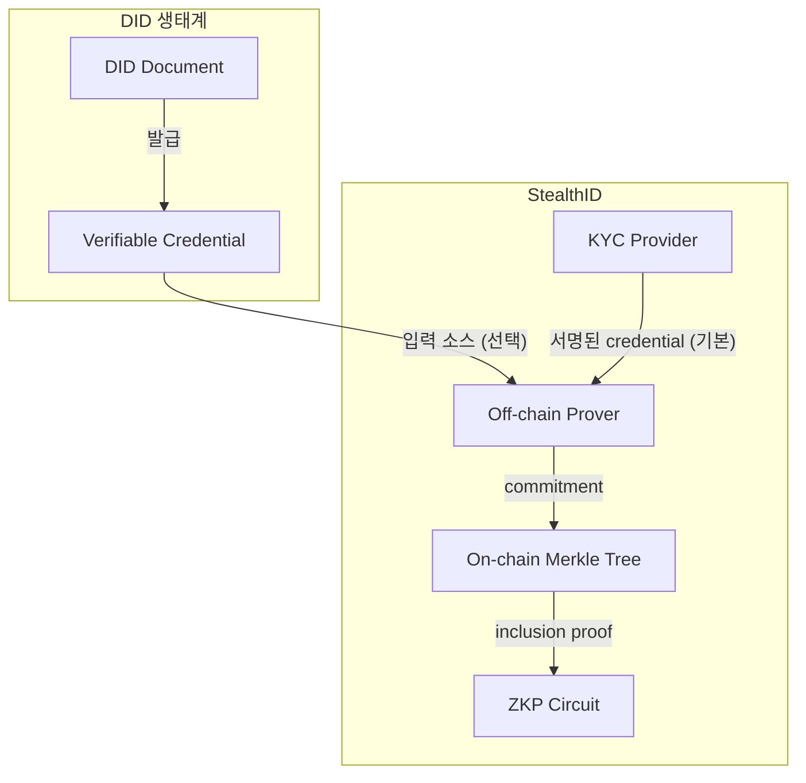

# StealthID

> ZKP-native portable credential layer — "나를 식별하지 마라, 자격만 확인해라"

KYC를 한 번 수행하고, 여러 서비스에서 신원 노출 없이 자격을 증명하는 프로토콜. [Privacy Pool](https://github.com/joey-to-nexus/privacy-pool)의 Registration Tree를 범용 Identity 인프라로 확장한다.

## 핵심 가치

| 기존 | StealthID |
|------|-----------|
| 서비스마다 KYC 반복 | **한 번 KYC, 어디서든 증명** |
| KYC 데이터가 서비스에 전달됨 | **ZKP로 자격만 증명, 데이터 노출 없음** |
| 서비스 간 동일 ID로 추적 가능 | **서비스마다 다른 proof, 연결 불가** |
| DID는 식별이 목적 | **StealthID는 비식별이 기본값** |

## 아키텍처



## DID와의 관계

StealthID는 DID가 아니다. DID는 **"나를 식별해라"**가 목적이고, StealthID는 **"나를 식별하지 마라"**가 목적이다.



| | DID (W3C) | StealthID |
|---|---|---|
| **핵심** | "나는 누구다" — 식별자 | "나는 자격이 있다" — 자격 증명 |
| **식별자** | `did:ethr:0x1234...` 영구 ID | 없음. nullifier로 중복 방지만 |
| **데이터** | VC에 속성 나열 | ZKP로 속성 노출 없이 증명 |
| **프라이버시** | 기본 공개, 선택적 은닉 | **기본 은닉, 필요 시 공개** |
| **연결성** | 서비스 간 동일 DID로 추적 가능 | 서비스마다 다른 proof, **연결 불가** |

**전략**: DID/VC를 credential 입력 소스의 하나로 지원(Polygon ID 호환)하되, StealthID의 정체성은 **ZKP-native credential layer**로 잡는다.

## 법적 재사용 구조

### FATF Recommendation 17 — Relying Party

KYC 결과를 제3자가 재사용할 수 있는 법적 근거:

| 조건 | 내용 |
|------|------|
| **원 검증자 책임** | KYC Provider(Sumsub)를 사용한 최초 서비스가 CDD 의무 보유 |
| **재사용 가능 범위** | 동일 위험 등급 이하의 서비스 |
| **의존 기관 책임** | 재사용 서비스도 최종 책임은 각자 보유 (면제 아님) |
| **유효기간** | 대부분 관할에서 1~3년 (국가별 상이) |
| **데이터 접근권** | 재사용 서비스가 원본 데이터에 접근 가능해야 함 |

### 제약사항 (반드시 고려)

1. **ZKP ≠ 데이터 이전** — 규제기관은 원본 데이터 제출을 요구할 수 있음. 온체인 ZKP만으로는 AML 감사 요건 충족 불가 → **오프체인 감사 레이어 필수**
2. **고위험 거래는 별도 KYC 재수행 가능** — 특히 금융 서비스 (대출, 거래소)
3. **GDPR (EU) / 개인정보보호법 (KR)** — 최소 수집 원칙. 오프체인 감사 레이어는 ZKP 프라이버시 보호와 규제 감사 사이의 충돌을 해결하는 필수 구성요소

### 오프체인 감사 레이어

> 이를 생략하면 법적 재사용 구조가 성립하지 않는다. MVP부터 포함.

- **암호화**: AES-256-GCM per-record encryption. Record key = `HKDF(master_key, commitment)`
- **접근 제어**: 2-of-3 threshold (Compliance Officer, CTO, External Legal Counsel). 운영팀도 단독 복호화 불가
- **동의 관리**: GDPR Article 6(1)(c) 기반. 동의 철회 시 삭제 (법적 보존 의무 기간 제외)
- 일상적으로는 ZKP만 사용, 감사/법 집행 시에만 원본 접근
- **TTL**: MVP에서는 한국 규제 기준 단일 정책 (1년 기본, 고위험 6개월)

## KYC Provider — Sumsub 통합

Sumsub + ZKP 이중 구조:

- **Sumsub ApplicantSharing API**: 한 번 검증된 applicant를 다른 Sumsub 고객사(clientId)에게 공유. `POST /resources/applicants/{applicantId}/shareToken`
- **Credential Issuer**: Sumsub 검증 결과를 수신하고, 서명된 attestation을 사용자에게 발급
- **User Prover**: attestation을 받아 commitment를 생성, 온체인 Merkle Tree에 등록

**Fallback**: Sumsub API가 요구사항을 충족하지 않을 경우, KYC 데이터 직접 export → Credential Issuer 자체 서명 발급 (법적 검토 필요).

## Unified Typed Tree — Privacy Pool 확장

현재 Privacy Pool의 Registration Tree(KYC-only, depth 16)를 확장:

```
leaf = poseidon2(identity_type, identifier, metadata, nullifier_seed)
```

| 필드 | Human (type=0) | Agent (type=1) |
|------|---------------|----------------|
| `identity_type` | `0` | `1` |
| `identifier` | `hash(sumsub_applicant_id \|\| user_pubkey)` | `hash(erc8004_agent_address \|\| sponsor_commitment)` |
| `metadata` | `hash(kyc_level \|\| verification_timestamp \|\| expiry)` | `hash(agent_capabilities \|\| delegation_scope \|\| expiry)` |
| `nullifier_seed` | 사용자가 로컬에서 생성한 랜덤 비밀값 | Agent operator가 생성한 랜덤 비밀값 |

- **identity_type**: 0=Human(KYC), 1=Agent(ERC-8004). (2=Delegated(ERC-7710)는 post-MVP 예약)
- **depth 20** (최대 ~1M leaves. depth 16→20은 proof 크기 20% 증가, 32 대비 40% 절감)
- **배포 타겟**: L2 우선 (Base, Arbitrum 등). L1은 root anchoring만.

Human과 AI Agent를 동일한 Merkle Tree에서 관리하되, ZKP로 신원 유형까지 은닉 가능. 서비스가 human-only 검증을 요구할 경우 circuit별 selective disclosure로 처리 — 추가 사용자 인터랙션 불필요.

### ZKP Circuits (Noir)

| Circuit | 증명 내용 | identity_type 공개 |
|---------|----------|-------------------|
| `prove_membership.nr` | 트리 멤버십 + revocation 미포함 | 비공개 |
| `prove_human.nr` | 멤버십 + 사람임 증명 | 공개 |
| `prove_agent_with_sponsor.nr` | 멤버십 + sponsor 인간 위임 연결 | 공개 |

- **Service-specific nullifier**: `nullifier = hash(nullifier_seed || service_id)` — 서비스마다 다른 nullifier로 연결 불가
- **Credential 해지**: 온체인 Revocation Nullifier Set (sparse Merkle tree). 검증 시 circuit이 non-membership proof 수행.

### Off-chain 컴포넌트 (신뢰 경계 분리)

| 컴포넌트 | 위치 | 역할 |
|---------|------|------|
| **Credential Issuer** | 서버 (trusted) | Sumsub 검증 결과 → 서명된 attestation 발급 |
| **User Prover** | 클라이언트 (trustless) | attestation → commitment 생성, proof 생성, 키 관리 |
| **Agent Registrar** | 서버 | ERC-8004 Agent 등록, sponsor 위임 flow 관리 |

## 프로젝트 구조

```
stealth-id/
├── docs/
│   ├── research/              # 리서치 문서
│   └── design-full-mvp.md     # Full MVP 설계 문서 (APPROVED)
├── circuits/                  # ZKP 회로 (Noir)
│   ├── prove_membership.nr
│   ├── prove_human.nr
│   └── prove_agent_with_sponsor.nr
├── contracts/                 # ERC-8004 레지스트리 + Merkle Tree (Foundry)
│   ├── src/erc8004/           # ERC-8004 레퍼런스 컨트랙트 (UUPS proxy)
│   ├── script/                # 배포 스크립트 (Anvil + vanity alias)
│   └── test/                  # 통합 테스트
└── packages/
    ├── credential-issuer/     # Sumsub 통합, attestation 발급 (서버)
    ├── prover/                # User Prover — commitment/proof 생성 (클라이언트)
    ├── agent-registrar/       # ERC-8004 Agent 등록, sponsor 위임 (서버)
    ├── sdk/                   # 서비스 통합 SDK (Go + TypeScript)
    └── audit-layer/           # 오프체인 감사 레이어 (API server)
```

## 리서치 항목

- [ ] Semaphore Protocol (PSE/EF) — 그룹 멤버십 ZKP, Solidity + circom
- [ ] Worldcoin/World ID — 생체 기반 ZKP 신원, 유사한 재사용 패턴
- [ ] Polygon ID — EVM + ZKP 자격증명, W3C VC 호환
- [ ] gnark (Consensys) — Go 기반 ZKP 프레임워크
- [ ] **Sumsub ApplicantSharing API 실제 동작 검증** ← 최우선 과제
- [ ] FATF Recommendation 17 관할별 구현 차이 (한국, EU, 미국)
- [ ] Noir 프리미티브 가용성 확인 — Poseidon2, EdDSA/BabyJubJub, sparse MT non-membership proof
- [ ] ERC-8004 agent metadata 인코딩 방식
- [ ] Revocation tree 구체적 구성 (indexed Merkle tree 등)

## 의존성

- [`@to-nexus/privacy-pool-sdk`](https://github.com/joey-to-nexus/privacy-pool) — Poseidon2, Merkle Tree 프리미티브
- [Sumsub](https://sumsub.com/) — KYC Provider + ApplicantSharing API
- [Noir](https://noir-lang.org/) — ZKP circuit 언어
- [Foundry](https://getfoundry.sh/) — 스마트 컨트랙트 개발/테스트/배포
- [ERC-8004](https://eips.ethereum.org/EIPS/eip-8004) — Agent identity 표준

## 관련 문서

- [개발 환경 셋업 가이드](./docs/dev-setup.md) — 로컬 Anvil 배포, ERC-8004 컨트랙트 테스트 환경 구성
- [Full MVP 설계 문서](./docs/design-full-mvp.md) — 아키텍처, 구현 순서, reviewer concerns 포함
- [Privacy Pool 로드맵 Phase 4](https://github.com/joey-to-nexus/privacy-pool/blob/main/docs/roadmap.md) — Identity & Reputation
- [Privacy Pool ADR-002](https://github.com/joey-to-nexus/privacy-pool/blob/main/docs/adr/002-registration-tree.md) — Registration Tree

## License

MIT
