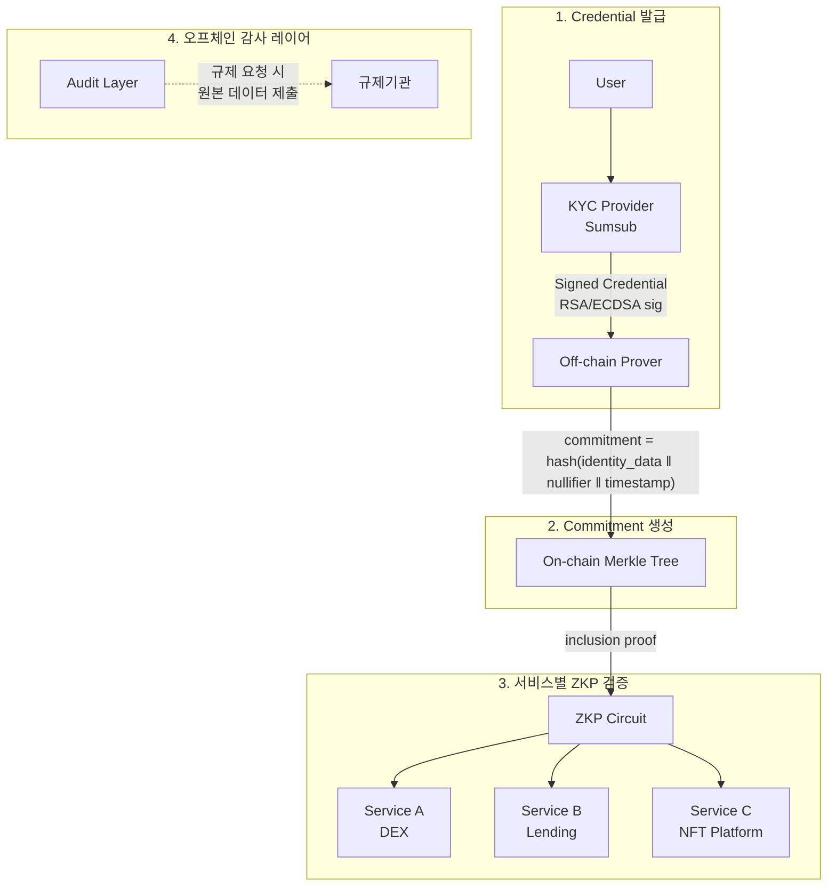
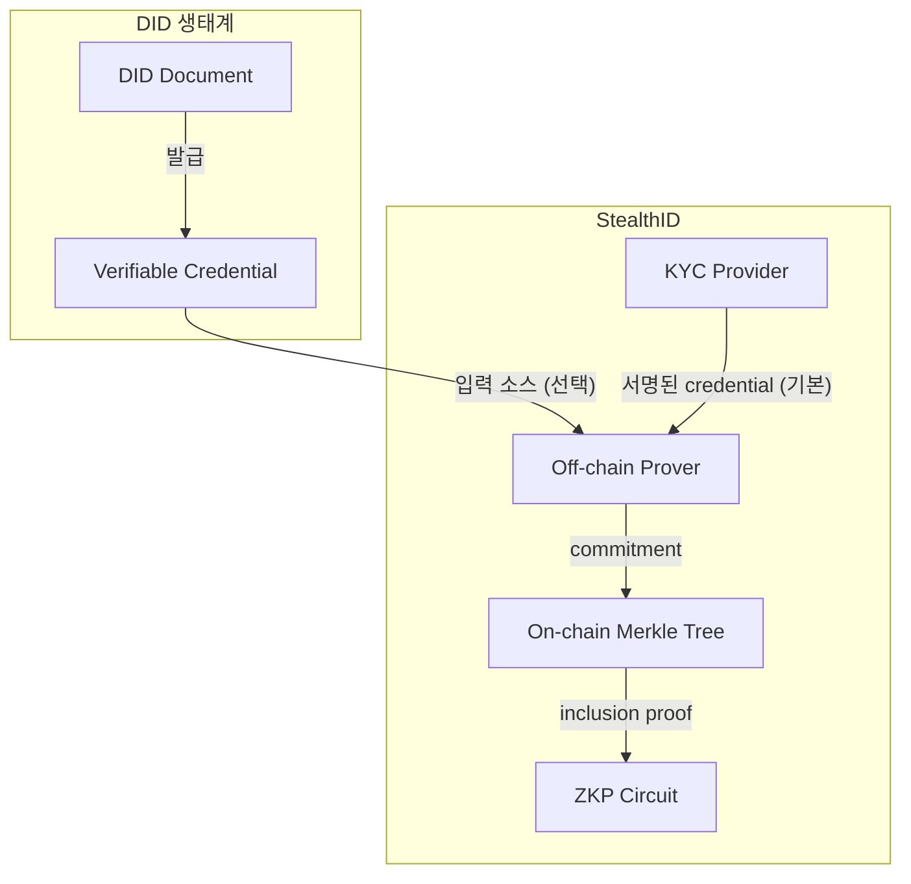

# StealthID

> ZKP-native portable credential layer — "나를 식별하지 마라, 자격만 확인해라"

KYC를 한 번 수행하고, 여러 서비스에서 신원 노출 없이 자격을 증명하는 프로토콜. [Privacy Pool](https://github.com/joey-to-nexus/privacy-pool)의 Registration Tree를 범용 Identity 인프라로 확장한다.

## 핵심 가치

| 기존 | StealthID |
|------|-----------|
| 서비스마다 KYC 반복 | **한 번 KYC, 어디서든 증명** |
| KYC 데이터가 서비스에 전달됨 | **ZKP로 자격만 증명, 데이터 노출 없음** |
| 서비스 간 동일 ID로 추적 가능 | **서비스마다 다른 proof, 연결 불가** |
| DID는 식별이 목적 | **StealthID는 비식별이 기본값** |

## 아키텍처



## DID와의 관계

StealthID는 DID가 아니다. DID는 **"나를 식별해라"**가 목적이고, StealthID는 **"나를 식별하지 마라"**가 목적이다.



| | DID (W3C) | StealthID |
|---|---|---|
| **핵심** | "나는 누구다" — 식별자 | "나는 자격이 있다" — 자격 증명 |
| **식별자** | `did:ethr:0x1234...` 영구 ID | 없음. nullifier로 중복 방지만 |
| **데이터** | VC에 속성 나열 | ZKP로 속성 노출 없이 증명 |
| **프라이버시** | 기본 공개, 선택적 은닉 | **기본 은닉, 필요 시 공개** |
| **연결성** | 서비스 간 동일 DID로 추적 가능 | 서비스마다 다른 proof, **연결 불가** |

**전략**: DID/VC를 credential 입력 소스의 하나로 지원(Polygon ID 호환)하되, StealthID의 정체성은 **ZKP-native credential layer**로 잡는다.

## 법적 재사용 구조

### FATF Recommendation 17 — Relying Party

KYC 결과를 제3자가 재사용할 수 있는 법적 근거:

| 조건 | 내용 |
|------|------|
| **원 검증자 책임** | KYC Provider(Sumsub)를 사용한 최초 서비스가 CDD 의무 보유 |
| **재사용 가능 범위** | 동일 위험 등급 이하의 서비스 |
| **의존 기관 책임** | 재사용 서비스도 최종 책임은 각자 보유 (면제 아님) |
| **유효기간** | 대부분 관할에서 1~3년 (국가별 상이) |
| **데이터 접근권** | 재사용 서비스가 원본 데이터에 접근 가능해야 함 |

### 제약사항 (반드시 고려)

1. **ZKP ≠ 데이터 이전** — 규제기관은 원본 데이터 제출을 요구할 수 있음. 온체인 ZKP만으로는 AML 감사 요건 충족 불가 → **오프체인 감사 레이어 필수**
2. **고위험 거래는 별도 KYC 재수행 가능** — 특히 금융 서비스 (대출, 거래소)
3. **GDPR (EU) / 개인정보보호법 (KR)** — 최소 수집 원칙. 오프체인 감사 레이어는 ZKP 프라이버시 보호와 규제 감사 사이의 충돌을 해결하는 필수 구성요소

### 오프체인 감사 레이어

> 이를 생략하면 법적 재사용 구조가 성립하지 않는다.

- 규제기관 요청 시 원본 KYC 데이터를 제출할 수 있는 경로 보장
- 사용자 동의 기반 데이터 접근 (GDPR 준수)
- 일상적으로는 ZKP만 사용, 감사/법 집행 시에만 원본 접근

## KYC Provider — Sumsub 통합

Sumsub의 **ApplicantSharing API**를 활용:

- 한 번 검증된 applicant를 다른 Sumsub 고객사(clientId)에게 공유
- 원본 검증 데이터 (liveness, 문서, 위험도) 재사용
- 유효기간 설정 가능 (검증 결과의 TTL)
- `POST /resources/applicants/{applicantId}/shareToken`

**제약**: Sumsub 생태계 내부 공유. 외부 체인 attestation으로 내보내려면 **Off-chain Prover에서 별도 서명 설계** 필요.

## Unified Identity Tree — Privacy Pool 확장

현재 Privacy Pool의 Registration Tree(KYC-only, depth 16)를 확장:

```
Leaf = poseidon2(identity_type, identifier, metadata)

identity_type:
  0 = Human (KYC)
  1 = Agent (ERC-8004)
  2 = Delegated (ERC-7710)
```

Human과 AI Agent를 동일한 Merkle Tree에서 관리하되, ZKP로 신원 유형까지 은닉 가능.

## 프로젝트 구조

```
stealth-id/
├── docs/research/         # 리서치 문서
├── circuits/              # ZKP 회로 (Noir)
├── contracts/             # Merkle Tree, Verifier
└── packages/
    ├── prover/            # Off-chain Prover (commitment 생성)
    ├── sdk/               # 서비스 통합 SDK
    └── audit-layer/       # 오프체인 감사 레이어
```

## 리서치 항목

- [ ] Semaphore Protocol (PSE/EF) — 그룹 멤버십 ZKP, Solidity + circom
- [ ] Worldcoin/World ID — 생체 기반 ZKP 신원, 유사한 재사용 패턴
- [ ] Polygon ID — EVM + ZKP 자격증명, W3C VC 호환
- [ ] gnark (Consensys) — Go 기반 ZKP 프레임워크
- [ ] Sumsub ApplicantSharing API 실제 동작 검증
- [ ] FATF Recommendation 17 관할별 구현 차이 (한국, EU, 미국)
- [ ] 오프체인 감사 레이어 설계 (GDPR + AML 동시 충족)
- [ ] Nullifier 설계 — 서비스 간 연결 불가능성 증명

## 의존성

- [`@to-nexus/privacy-pool-sdk`](https://github.com/joey-to-nexus/privacy-pool) — Poseidon2, Merkle Tree 프리미티브
- [Sumsub](https://sumsub.com/) — KYC Provider

## 관련 문서

- [Privacy Pool 로드맵 Phase 4](https://github.com/joey-to-nexus/privacy-pool/blob/main/docs/roadmap.md) — Identity & Reputation
- [Privacy Pool ADR-002](https://github.com/joey-to-nexus/privacy-pool/blob/main/docs/adr/002-registration-tree.md) — Registration Tree

## License

MIT
